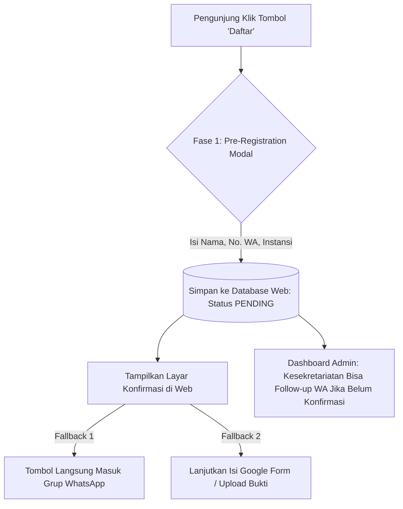

# Rencana Pembaruan Sistem (Next Update Roadmap)
## Solusi Penanganan Masalah Pendaftar Tanpa Identitas (GForm Drop-Off) & Pendaftaran Terintegrasi

Dokumen ini mendokumentasikan analisis masalah, akar penyebab, rencana perbaikan teknis, serta arsitektur solusi untuk pembaruan sistem berikutnya (*Next Update*) pada platform web **PARTI HIMATIF UMS 2026**.

---

## 1. Analisis Masalah & Akar Penyebab (Problem Statement)

### Kasus yang Terjadi di Lapangan:
Panitia menemukan kendala operasional yang krusial:
> **"Ada peserta yang sudah mendaftar / melakukan transfer pembayaran tiket, namun tidak mengisi Google Form pendaftaran. Akibatnya, panitia kesekretariatan tidak memiliki data kontak (nama, nomor WhatsApp, email, instansi), mutasi pembayaran tidak dapat diverifikasi, dan peserta tersebut tidak bisa dimasukkan ke dalam grup WhatsApp koordinasi acara."**

### Analisis Akar Penyebab (Root Cause Analysis):
1. **Ketergantungan Penuh pada Tautan Luar (Outbound Link Disconnection)**  
   Tombol "Daftar" di halaman sub-event publik saat ini hanya berupa tautan HTML murni (`<a href="..." target="_blank">`) yang langsung melempar peserta keluar ke Google Form tanpa ada pencatatan jejak (*lead tracking*) di database website.
2. **Ketiadaan Pre-Capture Data Pendaftar**  
   Website tidak meminta data dasar (minimal Nama & Nomor WhatsApp) sebelum melempar pendaftar ke Google Form. Jika tab browser tertutup, koneksi internet terputus, atau peserta lupa submit form, panitia sama sekali buta mengenai siapa yang berniat mendaftar.
3. **Asinkronitas Alur Pembayaran vs Pengisian Data**  
   Banyak peserta yang mentransfer HTM terlebih dahulu ke nomor rekening / e-wallet panitia, lalu menganggap proses pendaftaran sudah selesai tanpa menyelesaikan form administratif.
4. **Pemberian Tautan Grup WhatsApp yang Terisolasi**  
   Tautan grup WhatsApp biasanya hanya diletakkan di halaman akhir (*confirmation screen*) Google Form. Jika peserta gagal submit atau menutup tab lebih awal, mereka kehilangan akses ke grup tersebut selamanya.

---

## 2. Rencana Solusi Bertahap (Phased Solutions)

Rencana pembaruan dibagi menjadi 3 fase: **Solusi Darurat Saat Ini**, **Solusi Cepat Fase 1 (Pre-Registration Gate)**, dan **Solusi Permanen Fase 2 (Native Registration)**.



---

### Fase 0: Solusi Darurat Saat Ini (Immediate Workaround)
*Dapat diterapkan segera tanpa merombak sistem besar:*

1. **Tambahkan Callout "Bantuan Konfirmasi Pembayaran" di Halaman Sub-Acara:**  
   Tambahkan kotak informasi darurat di [`resources/views/public/sub-event-detail.blade.php`](file:///d:/Projek-web/Himatif_2026/Parti_Version%20compecx/parti2026/resources/views/public/sub-event-detail.blade.php):
   > *"Sudah melakukan transfer/pembayaran namun belum mengisi formulir atau belum masuk grup WhatsApp peserta? Segera konfirmasi ke Narahubung Kesekretariatan: [Klik Chat WhatsApp Panitia]."*
2. **Tampilkan Tombol Kontak Narahubung WhatsApp Resmi:**  
   Sediakan tombol cepat WhatsApp langsung ke nomor PJ / Kesekretariatan acara terkait di sebelah tombol daftar agar peserta yang bingung langsung menghubungi panitia.

---

### Fase 1: Pre-Registration Gate & Lead Capture (Solusi Cepat Terintegrasi)
*Mencegah peserta hilang saat menggunakan Google Form:*

#### Alur Kerja (Workflow):
1. **Modal Pendataan Awal Sebelum Redirect:**  
   Ketika tombol "Daftar" ditekan, buka pop-up modal modern (*macOS glassmorphism modal*) yang meminta 3 data wajib:
   - **Nama Lengkap**
   - **Nomor WhatsApp Aktif** (wajib format `08xx` atau `62xx`)
   - **Asal Instansi / Sekolah / Universitas**
2. **Penyimpanan ke Tabel `sub_event_leads`:**  
   Data langsung tersimpan di database website dengan status `PENDING_GFORM`.
3. **Penyajian Akses Ganda Setelah Input:**  
   Setelah tersimpan, modal langsung memberikan dua opsi aksi yang jelas:
   - **Aksi Utama**: Tombol *"Buka Formulir Pendaftaran Lengkap (Google Form)"*
   - **Aksi Cadangan**: Tombol *"Gabung Grup WhatsApp Peserta Sekarang"* (dengan catatan: wajib menyelesaikan pendaftaran).
4. **Panel Admin: Menu "Data Pendaftar / Leads":**  
   Tambahkan menu baru di panel admin untuk peran **SUPERADMIN** dan **KESEKRETARIATAN**:
   - Menampilkan daftar semua calon peserta yang mengklik pendaftaran.
   - Tombol satu klik **"Chat WhatsApp (`wa.me`)"** dengan template pesan otomatis:
     > *"Halo [Nama], terima kasih telah mendaftar di sub-acara [Nama Acara] PARTI 2026. Kami mendeteksi Anda belum melengkapi formulir/bukti pembayaran. Silakan selesaikan di tautan berikut atau kirimkan bukti transfer Anda di sini..."*
   - Tombol verifikasi status: `Belum Selesai`, `Sudah Konfirmasi`, `Sudah Masuk Grup`.

---

### Fase 2: Native In-House Registration System (Solusi Permanen / Next Major Update)
*Menghilangkan ketergantungan pada Google Form sepenuhnya:*

#### Fitur Utama:
1. **Formulir Pendaftaran Native Langsung di Web:**
   - Input identitas tim/individu lengkap.
   - Pilihan kategori tiket / HTM (Early Bird, Presale, Reguler) otomatis menghitung total bayar.
   - Unggah bukti pembayaran transfer / QRIS langsung ke storage sistem.
2. **Kode Registrasi Unik & E-Ticket:**
   - Sistem men-generate ID registrasi acak (contoh: `PARTI26-WEB-042`).
   - Peserta dapat mengecek status pendaftaran mandiri melalui fitur `/cek-pendaftaran` menggunakan Nomor WA atau Kode Registrasi.
3. **Verifikasi Pembayaran di Panel Admin:**
   - Kesekretariatan mengecek mutasi dan bukti transfer yang diunggah.
   - Status: `MENUNGGU_VERIFIKASI` ➔ `TERVERIFIKASI` atau `DITOLAK`.
4. **Distribusi Akses Grup WhatsApp Otomatis:**
   - Begitu status diset menjadi `TERVERIFIKASI`, link grup WhatsApp resmi terbuka di halaman dashboard peserta / dikirimkan via WhatsApp API gateway (misal Fonnte / Wablas).

---

## 3. Spesifikasi Teknis & Skema Database (Technical Blueprint)

### A. Skema Tabel Baru: `sub_event_leads` (Untuk Fase 1)

```sql
CREATE TABLE `sub_event_leads` (
    `id` BIGINT UNSIGNED AUTO_INCREMENT PRIMARY KEY,
    `sub_event_id` BIGINT UNSIGNED NOT NULL,
    `year` INT UNSIGNED NOT NULL DEFAULT 2026,
    `name` VARCHAR(255) NOT NULL,
    `whatsapp` VARCHAR(30) NOT NULL,
    `institution` VARCHAR(255) NOT NULL,
    `email` VARCHAR(255) NULL,
    `status` ENUM('PENDING', 'CONFIRMED', 'GROUP_JOINED', 'CANCELLED') DEFAULT 'PENDING',
    `notes` TEXT NULL,
    `ip_address` VARCHAR(45) NULL,
    `created_at` TIMESTAMP NULL DEFAULT CURRENT_TIMESTAMP,
    `updated_at` TIMESTAMP NULL DEFAULT CURRENT_TIMESTAMP ON UPDATE CURRENT_TIMESTAMP,
    FOREIGN KEY (`sub_event_id`) REFERENCES `sub_events`(`id`) ON DELETE CASCADE
) ENGINE=InnoDB DEFAULT CHARSET=utf8mb4 COLLATE=utf8mb4_unicode_ci;
```

### B. Endpoint API / Rute Baru di Laravel

```php
// Rute Publik (Web)
Route::post('/sub-event/{slug}/lead', [App\Http\Controllers\Public\SubEventController::class, 'storeLead'])
    ->name('public.sub-event.lead');

// Rute Panel Admin (Kesekretariatan & Superadmin)
Route::middleware(['auth'])->prefix('admin')->name('admin.')->group(function () {
    Route::get('/leads', [App\Http\Controllers\Admin\LeadController::class, 'index'])->name('leads.index');
    Route::patch('/leads/{id}/status', [App\Http\Controllers\Admin\LeadController::class, 'updateStatus'])->name('leads.updateStatus');
    Route::get('/leads/export', [App\Http\Controllers\Admin\LeadController::class, 'export'])->name('leads.export');
});
```

### C. Komponen Blade Modal Penampung (UI Preview)

```html
<!-- Modal Pre-Registration (Alpine.js) -->
<div x-data="{ open: false, submitted: false, leadData: {} }" x-show="open" class="fixed inset-0 z-50 flex items-center justify-center p-4 bg-black/60 backdrop-blur-sm">
    <div class="ios-glass w-full max-w-md p-6 rounded-[24px] shadow-2xl border border-line">
        <template x-if="!submitted">
            <form @submit.prevent="submitLead">
                <h4 class="text-ink font-bold text-lg mb-2">Formulir Prapendaftaran</h4>
                <p class="text-ink-soft text-xs mb-4">Mohon isi data kontak singkat agar panitia dapat memasukkan Anda ke grup koordinasi peserta.</p>
                
                <input type="text" placeholder="Nama Lengkap" x-model="leadData.name" required class="w-full mb-3 rounded-xl bg-black/5 dark:bg-white/5 border border-line px-4 py-2.5 text-sm">
                <input type="tel" placeholder="Nomor WhatsApp (Contoh: 08123456789)" x-model="leadData.whatsapp" required class="w-full mb-3 rounded-xl bg-black/5 dark:bg-white/5 border border-line px-4 py-2.5 text-sm">
                <input type="text" placeholder="Asal Instansi / Universitas / Sekolah" x-model="leadData.institution" required class="w-full mb-4 rounded-xl bg-black/5 dark:bg-white/5 border border-line px-4 py-2.5 text-sm">
                
                <button type="submit" class="w-full py-3 bg-ember text-white rounded-full font-semibold text-sm">
                    Lanjutkan ke Formulir Pendaftaran ➔
                </button>
            </form>
        </template>

        <template x-if="submitted">
            <div class="text-center space-y-4">
                <div class="w-12 h-12 bg-emerald-500/20 text-emerald-500 rounded-full flex items-center justify-center mx-auto text-xl">✓</div>
                <h4 class="font-bold text-ink">Data Berhasil Disimpan!</h4>
                <p class="text-xs text-ink-soft">Silakan bergabung ke grup koordinasi dan selesaikan formulir pendaftaran.</p>
                <div class="space-y-2 pt-2">
                    <a :href="waGroupUrl" target="_blank" class="block w-full py-2.5 bg-emerald-600 text-white rounded-full text-xs font-bold uppercase">
                        1. Gabung Grup WhatsApp Peserta
                    </a>
                    <a :href="gformUrl" target="_blank" class="block w-full py-2.5 bg-ember text-white rounded-full text-xs font-bold uppercase">
                        2. Lengkapi Google Form
                    </a>
                </div>
            </div>
        </template>
    </div>
</div>
```

---

## 4. Matriks Dampak & Hak Akses Fitur Baru

| Fitur / Menu Baru | SUPERADMIN | KESEKRETARIATAN | Catatan |
| :--- | :---: | :---: | :--- |
| **Melihat Daftar Leads / Pendaftar** | Ya | Ya | Filter berdasarkan Sub-Acara & Status. |
| **Follow-up Langsung (Tombol WhatsApp)** | Ya | Ya | Membuka pesan WhatsApp otomatis ke nomor pendaftar. |
| **Mengubah Status Konfirmasi Pendaftar** | Ya | Ya | Menandai peserta yang sudah lunas/lengkap. |
| **Ekspor Data Pendaftar (Excel / CSV)** | Ya | Ya | Memudahkan sinkronisasi dengan Google Sheets panitia. |
| **Menghapus / Membatalkan Lead Fiktif** | Ya | Tidak | Menghindari manipulasi data oleh pihak luar. |

---

## 5. Rencana Jadwal Pengerjaan (Action Items Checklist)

- [ ] **Langkah 1 (Hari Ini - Darurat):** Tambahkan banner kontak bantuan darurat di halaman sub-event publik untuk memfasilitasi peserta yang sudah telanjur bayar tapi belum mengisi form.
- [ ] **Langkah 2 (Minggu Ini - Fase 1):** Buat migrasi tabel `sub_event_leads`, buat modal pre-registration di Blade, serta hubungkan ke controller publik.
- [ ] **Langkah 3 (Minggu Ini - Fase 1):** Buat menu `Data Pendaftar` di Panel Admin agar panitia Kesekretariatan dapat mem-follow-up calon peserta yang menggantung.
- [ ] **Langkah 4 (Next Sprint - Fase 2):** Evaluasi kesiapan tim untuk beralih penuh ke *Native Registration* tanpa Google Form.
